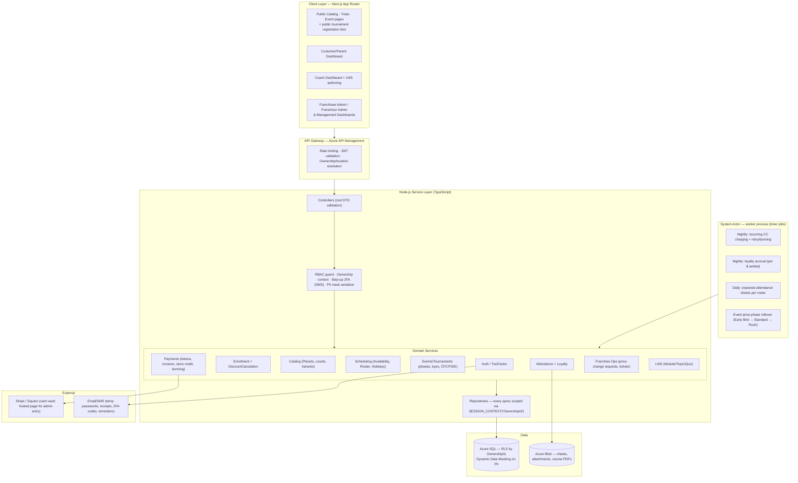

# Fraser Valley Chess Academy (FVCA) Management System

## Technical Specification — v2.0 (reconciled against *FVCA User Stories*)

**Stack:** Next.js (App Router, TypeScript) · Node.js (TypeScript, Controller–Service–Repository) · Azure SQL · Stripe/Square tokenized payments
**Status:** Implementation-ready for Phase 1 scope; later-phase items marked **[P2]** / **[P3]**.

---

## 0. Reconciliation Register (v1 assumptions vs. User Stories doc)

| v1 assumption | Verdict | Rule per document |
|---|---|---|
| A1 Multi-planet = 2+ program tracks per student | ✅ Confirmed, now concrete | Counted **per member**: 2 planets 5%, 3→10%, 4→15%, 5→20% — all configurable, governed by Franchisor |
| A2 Multi-frequency = 2+ sessions/week | ✅ Confirmed, now concrete | Same class twice/week 25%, thrice 35% (configurable); once/week = flat rate |
| A3 Private lessons use package pricing, no stacking | ✏️ Corrected | Private gets **only** a multi-session-per-week discount (configurable). **Private and Group discounts can never be combined.** |
| A4 Sibling discount | ❌ Removed | Not in the document |
| A5 Loyalty accrues per attended session | ✏️ Corrected | Loyalty is **monetary, at customer level**: points per $ spent, displayed on customer profile. Student gamification (attendance/homework/tournament points, badges) is a separate **[P3]** system |
| A6 Franchisees own customers; franchisor sees aggregates | ✅ Confirmed | Plus: franchisee submits **price change requests**; franchisor approves. Franchisor sees revenue by all ownerships/locations/planets/levels |
| A7 Byes requested per round | ✅ Confirmed, tightened | Byes **cannot use the last round** |
| — (missed in v1) | ➕ Added | `Location` entity under each Ownership; $25 one-time member setup fee; Early-Bird/Standard/Rush event pricing; store credits & $25 refund fee; 15-day cancellation notice; holiday calendars; coach availability/leave + 2-week roster; trials with batch capacity; IT/Non-IT tickets; LMS (Planet→Level→Module→Topic); play-up fee; CFC-ID surcharge |

**Open questions (build defaults chosen, confirm with business):**

| # | Question | Default implemented |
|---|---|---|
| OQ1 | Loyalty earn rate: doc says both "1 point per $" and "100 points per $, 10,000 pts = $1" | Configurable `LOYALTY_EARN_RATE` (default 100/$) and `LOYALTY_REDEEM_RATE` (10,000 pts = $1) |
| OQ2 | Does the multi-planet % apply to **all** of the member's group lines or only the added ones? | All group lines of that member in the billing period |
| OQ3 | Do frequency and multi-planet discounts stack for group? | Yes — frequency first, then planet % on the discounted amount |
| OQ4 | Do private enrollments count toward the member's planet count? | No (follows "cannot be combined") |

---

## 1. High-Level Architecture

Modular monolith (Azure App Service / Container Apps) + a separate worker process for the "System" actor, Azure SQL with Row-Level Security by Ownership.



Tenancy is enforced in three layers: JWT claim → middleware sets `SESSION_CONTEXT('OwnershipId')` → RLS security policy filters every table. Franchisor principals carry `IsFranchisor=1` for cross-ownership aggregate reads.

---

## 2. Database Schema (Azure SQL / T-SQL)

Domain vocabulary follows the document: **Ownership** (corporate/franchisee tenant) → **Location**; **Customer** (account holder) → **Member** (learner profile); **Planet → Level → Course variant**.

### 2.1 Ownership, Locations, Identity

```sql
CREATE TABLE Ownership (
    OwnershipId    UNIQUEIDENTIFIER NOT NULL DEFAULT NEWSEQUENTIALID() PRIMARY KEY,
    OwnershipType  VARCHAR(12) NOT NULL CHECK (OwnershipType IN ('CORPORATE','FRANCHISEE')),
    Name           NVARCHAR(120) NOT NULL,
    OwnerFullName  NVARCHAR(120) NOT NULL,
    OwnerEmail     NVARCHAR(254) NOT NULL,       -- management account; temp password emailed
    IsActive       BIT NOT NULL DEFAULT 1,
    CreatedAt      DATETIME2 NOT NULL DEFAULT SYSUTCDATETIME()
);

CREATE TABLE Location (
    LocationId   UNIQUEIDENTIFIER NOT NULL DEFAULT NEWSEQUENTIALID() PRIMARY KEY,
    OwnershipId  UNIQUEIDENTIFIER NOT NULL REFERENCES Ownership(OwnershipId),
    Name         NVARCHAR(120) NOT NULL,
    AddressLine1 NVARCHAR(120) NOT NULL,
    AddressLine2 NVARCHAR(120) NULL,
    City         NVARCHAR(80) NOT NULL,
    ProvinceState NVARCHAR(80) NOT NULL,
    Country      NVARCHAR(60) NOT NULL,
    PostalZip    NVARCHAR(12) NOT NULL,
    IsActive     BIT NOT NULL DEFAULT 1
);

CREATE TABLE HolidayCalendar (
    HolidayId    UNIQUEIDENTIFIER NOT NULL DEFAULT NEWSEQUENTIALID() PRIMARY KEY,
    OwnershipId  UNIQUEIDENTIFIER NOT NULL REFERENCES Ownership(OwnershipId),
    LocationId   UNIQUEIDENTIFIER NULL REFERENCES Location(LocationId), -- NULL = all locations
    HolidayDate  DATE NOT NULL,
    Name         NVARCHAR(100) NOT NULL
);

CREATE TABLE UserAccount (
    UserId          UNIQUEIDENTIFIER NOT NULL DEFAULT NEWSEQUENTIALID() PRIMARY KEY,
    Email           NVARCHAR(254) NOT NULL UNIQUE,
    PasswordHash    VARBINARY(256) NOT NULL,          -- argon2id
    MustResetPassword BIT NOT NULL DEFAULT 0,         -- temp-password flow for staff accounts
    PhoneNumber     NVARCHAR(25) NULL,                -- registered phone: required for customer 2FA
    TwoFactorMode   VARCHAR(10) NOT NULL DEFAULT 'NONE' CHECK (TwoFactorMode IN ('NONE','SMS','TOTP')),
    LastMfaAt       DATETIME2 NULL,
    IsLocked        BIT NOT NULL DEFAULT 0,
    CreatedAt       DATETIME2 NOT NULL DEFAULT SYSUTCDATETIME()
);

CREATE TABLE UserOwnershipRole (
    UserId      UNIQUEIDENTIFIER NOT NULL REFERENCES UserAccount(UserId),
    OwnershipId UNIQUEIDENTIFIER NOT NULL REFERENCES Ownership(OwnershipId),
    Role        VARCHAR(24) NOT NULL CHECK (Role IN (
                'FRANCHISOR_MANAGEMENT','FRANCHISOR_ADMIN',
                'FRANCHISEE_MANAGEMENT','FRANCHISEE_ADMIN',
                'COACH','EVENT_MANAGER','CUSTOMER','SYSTEM')),
    PRIMARY KEY (UserId, OwnershipId, Role)
);
```

### 2.2 Customers & Members (multi-profile)

```sql
CREATE TABLE CustomerProfile (
    CustomerId    UNIQUEIDENTIFIER NOT NULL DEFAULT NEWSEQUENTIALID() PRIMARY KEY,
    OwnershipId   UNIQUEIDENTIFIER NOT NULL REFERENCES Ownership(OwnershipId),
    UserId        UNIQUEIDENTIFIER NOT NULL REFERENCES UserAccount(UserId),
    FullName      NVARCHAR(120) NOT NULL,
    DateOfBirth   DATE NOT NULL,                 -- masked
    Gender        NVARCHAR(20) NULL,             -- masked
    Phone         NVARCHAR(25) NOT NULL,         -- masked
    EmergencyContact NVARCHAR(25) NOT NULL,      -- masked
    CfcId         VARCHAR(20) NULL,
    NearestLocationId UNIQUEIDENTIFIER NOT NULL REFERENCES Location(LocationId),
    TncAcceptedAt DATETIME2 NOT NULL,            -- the two mandatory checkboxes
    AccountConsentAt DATETIME2 NOT NULL
);

-- Other accessible locations, if any
CREATE TABLE CustomerLocation (
    CustomerId UNIQUEIDENTIFIER NOT NULL REFERENCES CustomerProfile(CustomerId),
    LocationId UNIQUEIDENTIFIER NOT NULL REFERENCES Location(LocationId),
    PRIMARY KEY (CustomerId, LocationId)
);

CREATE TABLE MemberProfile (
    MemberId     UNIQUEIDENTIFIER NOT NULL DEFAULT NEWSEQUENTIALID() PRIMARY KEY,
    OwnershipId  UNIQUEIDENTIFIER NOT NULL REFERENCES Ownership(OwnershipId),
    CustomerId   UNIQUEIDENTIFIER NOT NULL REFERENCES CustomerProfile(CustomerId),
    IsSelf       BIT NOT NULL DEFAULT 0,         -- "Register me as a member as well"
    FirstName    NVARCHAR(60) NOT NULL,
    LastName     NVARCHAR(60) NOT NULL,
    DateOfBirth  DATE NOT NULL,                  -- masked
    Gender       NVARCHAR(20) NULL,              -- masked
    Grade        NVARCHAR(20) NULL,
    Email        NVARCHAR(254) NULL,             -- optional, only if separate from parent; masked
    EmergencyContact NVARCHAR(25) NULL,          -- masked
    CfcId        VARCHAR(20) NULL,               -- chess products only
    FideId       VARCHAR(20) NULL,
    TShirtSize   VARCHAR(10) NULL,
    PreferredColor NVARCHAR(30) NULL,
    SetupFeePaidAt DATETIME2 NULL                -- $25 one-time member setup fee marker
);
```

### 2.3 Row-Level Security

```sql
CREATE SCHEMA sec;
GO
CREATE FUNCTION sec.fn_OwnershipFilter(@OwnershipId UNIQUEIDENTIFIER)
RETURNS TABLE WITH SCHEMABINDING AS
RETURN SELECT 1 AS ok
WHERE @OwnershipId = CAST(SESSION_CONTEXT(N'OwnershipId') AS UNIQUEIDENTIFIER)
   OR CAST(SESSION_CONTEXT(N'IsFranchisor') AS BIT) = 1;   -- cross-ownership reporting
GO
CREATE SECURITY POLICY sec.OwnershipIsolationPolicy
    ADD FILTER PREDICATE sec.fn_OwnershipFilter(OwnershipId) ON dbo.CustomerProfile,
    ADD FILTER PREDICATE sec.fn_OwnershipFilter(OwnershipId) ON dbo.MemberProfile,
    ADD FILTER PREDICATE sec.fn_OwnershipFilter(OwnershipId) ON dbo.Enrollment,
    ADD FILTER PREDICATE sec.fn_OwnershipFilter(OwnershipId) ON dbo.Invoice
    /* ...every ownership-scoped table... */
WITH (STATE = ON);
```

### 2.4 Catalog: Planets → Levels → Course Variants; Location Schedules

```sql
-- Franchisor-defined
CREATE TABLE Planet (
    PlanetId  UNIQUEIDENTIFIER NOT NULL DEFAULT NEWSEQUENTIALID() PRIMARY KEY,
    Name      NVARCHAR(80) NOT NULL,             -- Chess, Maths, English, Finance, Fine Arts
    IsActive  BIT NOT NULL DEFAULT 1
);

CREATE TABLE Level (
    LevelId   UNIQUEIDENTIFIER NOT NULL DEFAULT NEWSEQUENTIALID() PRIMARY KEY,
    PlanetId  UNIQUEIDENTIFIER NOT NULL REFERENCES Planet(PlanetId),
    Name      NVARCHAR(80) NOT NULL,             -- PP/RR (Chess), Grade 1-10 (Math)
    LevelOrder INT NOT NULL,
    ModuleOverview NVARCHAR(MAX) NULL            -- highlights shown to customers
);

-- Course = sellable definition at a Level, with image for the website
CREATE TABLE Course (
    CourseId   UNIQUEIDENTIFIER NOT NULL DEFAULT NEWSEQUENTIALID() PRIMARY KEY,
    LevelId    UNIQUEIDENTIFIER NOT NULL REFERENCES Level(LevelId),
    ImageUrl   NVARCHAR(400) NULL,
    SessionMinutes SMALLINT NOT NULL,            -- Pre-K/Elem 60, Middle 90, High 90/120
    IsActive   BIT NOT NULL DEFAULT 1
);

-- Franchisor list price per frequency/setting. E.g. Maths Gr10: 1x $159, 2x $199, 3x $229
CREATE TABLE CourseVariant (
    VariantId       UNIQUEIDENTIFIER NOT NULL DEFAULT NEWSEQUENTIALID() PRIMARY KEY,
    CourseId        UNIQUEIDENTIFIER NOT NULL REFERENCES Course(CourseId),
    ClassSetting    VARCHAR(10) NOT NULL CHECK (ClassSetting IN ('GROUP','PRIVATE')),
    SessionsPerWeek TINYINT NOT NULL DEFAULT 1,
    ListPriceCents  INT NOT NULL,                -- franchisor rate (monthly)
    Currency        CHAR(3) NOT NULL DEFAULT 'CAD'
);

-- Which planets/courses a location offers + local price (only via approved change requests)
CREATE TABLE LocationCourseOffering (
    OfferingId   UNIQUEIDENTIFIER NOT NULL DEFAULT NEWSEQUENTIALID() PRIMARY KEY,
    OwnershipId  UNIQUEIDENTIFIER NOT NULL REFERENCES Ownership(OwnershipId),
    LocationId   UNIQUEIDENTIFIER NOT NULL REFERENCES Location(LocationId),
    VariantId    UNIQUEIDENTIFIER NOT NULL REFERENCES CourseVariant(VariantId),
    LocalPriceCents INT NULL,                    -- NULL = franchisor rate applies
    IsActive     BIT NOT NULL DEFAULT 1
);

-- Weekly schedule slots (batches) per offering; capacity shown publicly as remaining count
CREATE TABLE Batch (
    BatchId     UNIQUEIDENTIFIER NOT NULL DEFAULT NEWSEQUENTIALID() PRIMARY KEY,
    OwnershipId UNIQUEIDENTIFIER NOT NULL REFERENCES Ownership(OwnershipId),
    OfferingId  UNIQUEIDENTIFIER NOT NULL REFERENCES LocationCourseOffering(OfferingId),
    DayOfWeek   TINYINT NOT NULL CHECK (DayOfWeek BETWEEN 0 AND 6),
    StartTime   TIME NOT NULL,
    Capacity    INT NOT NULL,
    IsActive    BIT NOT NULL DEFAULT 1
);
```

### 2.5 Price Change Requests (Franchisee → Franchisor)

```sql
CREATE TABLE PriceChangeRequest (
    RequestId     UNIQUEIDENTIFIER NOT NULL DEFAULT NEWSEQUENTIALID() PRIMARY KEY,
    OwnershipId   UNIQUEIDENTIFIER NOT NULL REFERENCES Ownership(OwnershipId), -- requesting franchisee
    VariantId     UNIQUEIDENTIFIER NOT NULL REFERENCES CourseVariant(VariantId),
    FranchisorRateCents INT NOT NULL,            -- snapshot of current rate
    RequestedRateCents  INT NOT NULL,
    Reason        NVARCHAR(1000) NOT NULL,
    Status        VARCHAR(10) NOT NULL DEFAULT 'PENDING'
                  CHECK (Status IN ('PENDING','APPROVED','REJECTED','WITHDRAWN')),
    DecidedByUserId UNIQUEIDENTIFIER NULL REFERENCES UserAccount(UserId),
    DecidedAt     DATETIME2 NULL,
    CreatedAt     DATETIME2 NOT NULL DEFAULT SYSUTCDATETIME()
);

CREATE TABLE PriceChangeAttachment (
    AttachmentId UNIQUEIDENTIFIER NOT NULL DEFAULT NEWSEQUENTIALID() PRIMARY KEY,
    RequestId    UNIQUEIDENTIFIER NOT NULL REFERENCES PriceChangeRequest(RequestId),
    BlobUrl      NVARCHAR(400) NOT NULL,
    FileName     NVARCHAR(200) NOT NULL
);
-- On APPROVED: system writes LocationCourseOffering.LocalPriceCents for the ownership's locations.
```

### 2.6 Enrollment & Configurable Discounts

```sql
CREATE TABLE Enrollment (
    EnrollmentId UNIQUEIDENTIFIER NOT NULL DEFAULT NEWSEQUENTIALID() PRIMARY KEY,
    OwnershipId  UNIQUEIDENTIFIER NOT NULL REFERENCES Ownership(OwnershipId),
    MemberId     UNIQUEIDENTIFIER NOT NULL REFERENCES MemberProfile(MemberId),
    OfferingId   UNIQUEIDENTIFIER NOT NULL REFERENCES LocationCourseOffering(OfferingId),
    Status       VARCHAR(12) NOT NULL DEFAULT 'ACTIVE'
                 CHECK (Status IN ('PENDING','ACTIVE','NOTICE_GIVEN','CANCELLED','PAUSED')),
    StartDate    DATE NOT NULL,
    CancellationNoticeAt DATETIME2 NULL,         -- 15-day notice clock starts here
    EndDate      DATE NULL,                      -- = notice date + 15 days minimum
    CreatedAt    DATETIME2 NOT NULL DEFAULT SYSUTCDATETIME()
);

-- Chosen weekly slots for the enrollment (one row per weekly class)
CREATE TABLE EnrollmentSlot (
    EnrollmentId UNIQUEIDENTIFIER NOT NULL REFERENCES Enrollment(EnrollmentId),
    BatchId      UNIQUEIDENTIFIER NOT NULL REFERENCES Batch(BatchId),
    PRIMARY KEY (EnrollmentId, BatchId)
);

-- Franchisor-configurable discount tiers (the doc's Rules 1-3)
CREATE TABLE DiscountTier (
    TierId     UNIQUEIDENTIFIER NOT NULL DEFAULT NEWSEQUENTIALID() PRIMARY KEY,
    RuleType   VARCHAR(20) NOT NULL CHECK (RuleType IN
               ('GROUP_FREQUENCY','MULTI_PLANET','PRIVATE_FREQUENCY')),
    ThresholdCount TINYINT NOT NULL,             -- sessions/week or planet count
    Percent    DECIMAL(5,2) NOT NULL,            -- 25.00, 35.00 / 5,10,15,20
    EffectiveFrom DATE NOT NULL, EffectiveTo DATE NULL,
    CONSTRAINT UQ_Tier UNIQUE (RuleType, ThresholdCount, EffectiveFrom)
);
-- Seed: GROUP_FREQUENCY (2→25, 3→35); MULTI_PLANET (2→5, 3→10, 4→15, 5→20);
--       PRIVATE_FREQUENCY (2→x, 3→y) — franchisor sets x,y.

-- Immutable pricing audit per invoice line
CREATE TABLE AppliedDiscount (
    AppliedDiscountId UNIQUEIDENTIFIER NOT NULL DEFAULT NEWSEQUENTIALID() PRIMARY KEY,
    OwnershipId   UNIQUEIDENTIFIER NOT NULL,
    InvoiceLineId UNIQUEIDENTIFIER NOT NULL,     -- FK added below
    TierId        UNIQUEIDENTIFIER NOT NULL REFERENCES DiscountTier(TierId),
    AmountCents   INT NOT NULL,
    Explanation   NVARCHAR(400) NOT NULL         -- '3 planets: -10%', 'Twice weekly: -25%'
);

-- Global configurable values (admin-editable)
CREATE TABLE SystemConfig (
    ConfigKey   VARCHAR(60) NOT NULL PRIMARY KEY,  -- MEMBER_SETUP_FEE_CENTS=2500,
    ConfigValue NVARCHAR(200) NOT NULL,            -- REFUND_FEE_CENTS=2500,
    UpdatedBy   UNIQUEIDENTIFIER NULL,             -- LOYALTY_EARN_RATE, LOYALTY_REDEEM_RATE,
    UpdatedAt   DATETIME2 NOT NULL DEFAULT SYSUTCDATETIME() -- WELCOME_BONUS_POINTS, CANCEL_NOTICE_DAYS=15
);
```

### 2.7 Billing, Tokenized Payments, Store Credit, Loyalty

No PAN ever touches the database (SAQ-A). Admin-entered cards go through the **gateway-hosted page** (Stripe Checkout/Elements), per the doc's stated preference.

```sql
CREATE TABLE PaymentMethod (
    PaymentMethodId UNIQUEIDENTIFIER NOT NULL DEFAULT NEWSEQUENTIALID() PRIMARY KEY,
    OwnershipId  UNIQUEIDENTIFIER NOT NULL REFERENCES Ownership(OwnershipId),
    CustomerId   UNIQUEIDENTIFIER NOT NULL REFERENCES CustomerProfile(CustomerId),
    Gateway      VARCHAR(10) NOT NULL CHECK (Gateway IN ('STRIPE','SQUARE')),
    GatewayCustomerRef NVARCHAR(120) NOT NULL,
    GatewayTokenRef    NVARCHAR(120) NOT NULL,
    Brand VARCHAR(20) NULL, Last4 CHAR(4) NULL, ExpMonth TINYINT NULL, ExpYear SMALLINT NULL,
    IsDefault    BIT NOT NULL DEFAULT 0,
    IsSavedForRecurring BIT NOT NULL DEFAULT 0   -- mandatory=1 when any subscription active
);

CREATE TABLE Invoice (
    InvoiceId   UNIQUEIDENTIFIER NOT NULL DEFAULT NEWSEQUENTIALID() PRIMARY KEY,
    OwnershipId UNIQUEIDENTIFIER NOT NULL REFERENCES Ownership(OwnershipId),
    CustomerId  UNIQUEIDENTIFIER NOT NULL REFERENCES CustomerProfile(CustomerId),
    PeriodStart DATE NULL, PeriodEnd DATE NULL,  -- NULL for one-off (events, merch)
    SubtotalCents INT NOT NULL, DiscountCents INT NOT NULL,
    StoreCreditAppliedCents INT NOT NULL DEFAULT 0,
    TotalCents  INT NOT NULL,
    Status      VARCHAR(12) NOT NULL DEFAULT 'OPEN'
                CHECK (Status IN ('OPEN','PAID','FAILED','DUNNING','VOID','REFUNDED')),
    CreatedAt   DATETIME2 NOT NULL DEFAULT SYSUTCDATETIME()
);

CREATE TABLE InvoiceLine (
    InvoiceLineId UNIQUEIDENTIFIER NOT NULL DEFAULT NEWSEQUENTIALID() PRIMARY KEY,
    OwnershipId  UNIQUEIDENTIFIER NOT NULL REFERENCES Ownership(OwnershipId),
    InvoiceId    UNIQUEIDENTIFIER NOT NULL REFERENCES Invoice(InvoiceId),
    LineType     VARCHAR(20) NOT NULL CHECK (LineType IN
                 ('COURSE','SETUP_FEE','EVENT_ENTRY','PLAY_UP_FEE','CFC_ID_FEE',
                  'MERCHANDISE','CAMP','REFUND_FEE','SUB_EVENT')),
    EnrollmentId UNIQUEIDENTIFIER NULL REFERENCES Enrollment(EnrollmentId),
    MemberId     UNIQUEIDENTIFIER NULL REFERENCES MemberProfile(MemberId),
    Description  NVARCHAR(200) NOT NULL,
    AmountCents  INT NOT NULL
);
ALTER TABLE AppliedDiscount ADD CONSTRAINT FK_AppliedDiscount_Line
  FOREIGN KEY (InvoiceLineId) REFERENCES InvoiceLine(InvoiceLineId);

CREATE TABLE PaymentTransaction (
    TransactionId  UNIQUEIDENTIFIER NOT NULL DEFAULT NEWSEQUENTIALID() PRIMARY KEY,
    OwnershipId    UNIQUEIDENTIFIER NOT NULL REFERENCES Ownership(OwnershipId),
    InvoiceId      UNIQUEIDENTIFIER NOT NULL REFERENCES Invoice(InvoiceId),
    PaymentMethodId UNIQUEIDENTIFIER NULL REFERENCES PaymentMethod(PaymentMethodId),
    Channel        VARCHAR(12) NOT NULL CHECK (Channel IN ('CARD_ONLINE','CARD_ON_FILE','POS','CASH')),
    GatewayChargeRef NVARCHAR(120) NULL,
    AmountCents    INT NOT NULL,
    Status         VARCHAR(10) NOT NULL CHECK (Status IN ('SUCCEEDED','FAILED','REFUNDED')),
    FailureCode    NVARCHAR(60) NULL,
    ActorType      VARCHAR(10) NOT NULL CHECK (ActorType IN ('SYSTEM','ADMIN','CUSTOMER')),
    AttemptNo      TINYINT NOT NULL DEFAULT 1,
    CreatedAt      DATETIME2 NOT NULL DEFAULT SYSUTCDATETIME()
);

-- Store credit: cancellations → free credit; cash-back refund incurs $25 fee.
-- Every cancellation credit MUST reference the original transaction.
CREATE TABLE StoreCreditLedger (
    EntryId     UNIQUEIDENTIFIER NOT NULL DEFAULT NEWSEQUENTIALID() PRIMARY KEY,
    OwnershipId UNIQUEIDENTIFIER NOT NULL REFERENCES Ownership(OwnershipId),
    CustomerId  UNIQUEIDENTIFIER NOT NULL REFERENCES CustomerProfile(CustomerId),
    AmountCents INT NOT NULL,                    -- negative = spent
    Reason      VARCHAR(20) NOT NULL CHECK (Reason IN ('CANCELLATION','ADMIN_GRANT','REDEEMED','LOYALTY_REDEEM')),
    OriginTransactionId UNIQUEIDENTIFIER NULL REFERENCES PaymentTransaction(TransactionId),
    GrantedByUserId UNIQUEIDENTIFIER NULL,
    CreatedAt   DATETIME2 NOT NULL DEFAULT SYSUTCDATETIME(),
    CONSTRAINT CK_CancelHasOrigin CHECK (Reason <> 'CANCELLATION' OR OriginTransactionId IS NOT NULL)
);

-- Customer-level monetary loyalty (points per $ settled; welcome bonus on signup)
CREATE TABLE LoyaltyLedger (
    EntryId    UNIQUEIDENTIFIER NOT NULL DEFAULT NEWSEQUENTIALID() PRIMARY KEY,
    OwnershipId UNIQUEIDENTIFIER NOT NULL REFERENCES Ownership(OwnershipId),
    CustomerId UNIQUEIDENTIFIER NOT NULL REFERENCES CustomerProfile(CustomerId),
    Points     INT NOT NULL,                     -- negative = redemption
    Reason     VARCHAR(20) NOT NULL CHECK (Reason IN ('SPEND','WELCOME_BONUS','REDEEM','ADJUST')),
    SourceRef  UNIQUEIDENTIFIER NULL,            -- TransactionId for SPEND
    CreatedAt  DATETIME2 NOT NULL DEFAULT SYSUTCDATETIME(),
    CONSTRAINT UQ_Loyalty_Source UNIQUE (Reason, SourceRef)  -- idempotent accrual job
);
```

### 2.8 Scheduling: Availability, Leaves, Roster, Sessions

```sql
-- Coach declares weekly availability up to 6 months out; carries over unless a leave is applied
CREATE TABLE CoachAvailability (
    AvailabilityId UNIQUEIDENTIFIER NOT NULL DEFAULT NEWSEQUENTIALID() PRIMARY KEY,
    OwnershipId UNIQUEIDENTIFIER NOT NULL REFERENCES Ownership(OwnershipId),
    CoachUserId UNIQUEIDENTIFIER NOT NULL REFERENCES UserAccount(UserId),
    DayOfWeek   TINYINT NOT NULL CHECK (DayOfWeek BETWEEN 0 AND 6),
    StartTime   TIME NOT NULL, EndTime TIME NOT NULL,
    EffectiveFrom DATE NOT NULL, EffectiveTo DATE NULL   -- NULL = carries over
);

CREATE TABLE CoachLeave (
    LeaveId     UNIQUEIDENTIFIER NOT NULL DEFAULT NEWSEQUENTIALID() PRIMARY KEY,
    OwnershipId UNIQUEIDENTIFIER NOT NULL REFERENCES Ownership(OwnershipId),
    CoachUserId UNIQUEIDENTIFIER NOT NULL REFERENCES UserAccount(UserId),
    FromDate    DATE NOT NULL, ToDate DATE NOT NULL,
    Note        NVARCHAR(300) NULL
);

-- Roster: generated 2 weeks ahead, at least 1 week in advance; honors holidays + leaves
CREATE TABLE RosterAssignment (
    RosterId    UNIQUEIDENTIFIER NOT NULL DEFAULT NEWSEQUENTIALID() PRIMARY KEY,
    OwnershipId UNIQUEIDENTIFIER NOT NULL REFERENCES Ownership(OwnershipId),
    LocationId  UNIQUEIDENTIFIER NOT NULL REFERENCES Location(LocationId),
    BatchId     UNIQUEIDENTIFIER NOT NULL REFERENCES Batch(BatchId),
    CoachUserId UNIQUEIDENTIFIER NOT NULL REFERENCES UserAccount(UserId),
    WorkDate    DATE NOT NULL,
    PublishedAt DATETIME2 NULL,
    CONSTRAINT UQ_Roster UNIQUE (BatchId, WorkDate)
);

-- Concrete class occurrence (materialized from Batch × date, skipping holidays)
CREATE TABLE ClassSession (
    SessionId   UNIQUEIDENTIFIER NOT NULL DEFAULT NEWSEQUENTIALID() PRIMARY KEY,
    OwnershipId UNIQUEIDENTIFIER NOT NULL REFERENCES Ownership(OwnershipId),
    BatchId     UNIQUEIDENTIFIER NOT NULL REFERENCES Batch(BatchId),
    CoachUserId UNIQUEIDENTIFIER NULL REFERENCES UserAccount(UserId),
    SessionDate DATE NOT NULL,
    StartTime   TIME NOT NULL, EndTime TIME NOT NULL,
    Status      VARCHAR(12) NOT NULL DEFAULT 'SCHEDULED'
                CHECK (Status IN ('SCHEDULED','COMPLETED','CANCELLED','HOLIDAY')),
    CONSTRAINT UQ_Session UNIQUE (BatchId, SessionDate)
);
```

### 2.9 Trials, Attendance, Session Notes

```sql
CREATE TABLE TrialBooking (
    TrialId     UNIQUEIDENTIFIER NOT NULL DEFAULT NEWSEQUENTIALID() PRIMARY KEY,
    OwnershipId UNIQUEIDENTIFIER NOT NULL REFERENCES Ownership(OwnershipId),
    MemberId    UNIQUEIDENTIFIER NOT NULL REFERENCES MemberProfile(MemberId),
    SessionId   UNIQUEIDENTIFIER NOT NULL REFERENCES ClassSession(SessionId),
    Status      VARCHAR(12) NOT NULL DEFAULT 'BOOKED'
                CHECK (Status IN ('BOOKED','ATTENDED','NO_SHOW','CONVERTED'))
);

-- Coach trial assessment → visible to admin/manager AND on parent dashboard
CREATE TABLE TrialAssessment (
    AssessmentId UNIQUEIDENTIFIER NOT NULL DEFAULT NEWSEQUENTIALID() PRIMARY KEY,
    OwnershipId  UNIQUEIDENTIFIER NOT NULL REFERENCES Ownership(OwnershipId),
    TrialId      UNIQUEIDENTIFIER NOT NULL REFERENCES TrialBooking(TrialId),
    CoachUserId  UNIQUEIDENTIFIER NOT NULL REFERENCES UserAccount(UserId),
    Feedback     NVARCHAR(MAX) NOT NULL,
    AttachmentUrl NVARCHAR(400) NULL,
    RecommendedBatchId UNIQUEIDENTIFIER NULL REFERENCES Batch(BatchId),
    SubmittedAt  DATETIME2 NOT NULL DEFAULT SYSUTCDATETIME()
);

CREATE TABLE AttendanceRecord (
    AttendanceId UNIQUEIDENTIFIER NOT NULL DEFAULT NEWSEQUENTIALID() PRIMARY KEY,
    OwnershipId  UNIQUEIDENTIFIER NOT NULL REFERENCES Ownership(OwnershipId),
    SessionId    UNIQUEIDENTIFIER NOT NULL REFERENCES ClassSession(SessionId),
    MemberId     UNIQUEIDENTIFIER NOT NULL REFERENCES MemberProfile(MemberId),
    Status       VARCHAR(10) NOT NULL DEFAULT 'EXPECTED'
                 CHECK (Status IN ('EXPECTED','PRESENT','ABSENT','LATE','MAKEUP','TRIAL')),
    MarkedByUserId UNIQUEIDENTIFIER NULL, MarkedAt DATETIME2 NULL,
    CONSTRAINT UQ_Attendance UNIQUE (SessionId, MemberId)
);

-- Coach per-session notes: topics covered, homework given/done
CREATE TABLE SessionNote (
    NoteId      UNIQUEIDENTIFIER NOT NULL DEFAULT NEWSEQUENTIALID() PRIMARY KEY,
    OwnershipId UNIQUEIDENTIFIER NOT NULL REFERENCES Ownership(OwnershipId),
    SessionId   UNIQUEIDENTIFIER NOT NULL REFERENCES ClassSession(SessionId),
    MemberId    UNIQUEIDENTIFIER NULL REFERENCES MemberProfile(MemberId), -- NULL = whole class
    TopicsCovered NVARCHAR(MAX) NULL,
    HomeworkAssigned NVARCHAR(MAX) NULL,
    HomeworkDone BIT NULL,
    CoachUserId UNIQUEIDENTIFIER NOT NULL REFERENCES UserAccount(UserId),
    CreatedAt   DATETIME2 NOT NULL DEFAULT SYSUTCDATETIME()
);
```

### 2.10 Events / Tournaments

```sql
CREATE TABLE Event (
    EventId     UNIQUEIDENTIFIER NOT NULL DEFAULT NEWSEQUENTIALID() PRIMARY KEY,
    OwnershipId UNIQUEIDENTIFIER NOT NULL REFERENCES Ownership(OwnershipId),
    LocationId  UNIQUEIDENTIFIER NULL REFERENCES Location(LocationId),
    EventType   VARCHAR(12) NOT NULL CHECK (EventType IN ('TOURNAMENT','CAMP','CLUB','OTHER')),
    Name        NVARCHAR(150) NOT NULL,
    StartDate   DATE NOT NULL, EndDate DATE NOT NULL,
    Rounds      TINYINT NULL,                    -- tournaments
    MaxByes     TINYINT NULL,                    -- byes cannot use last round (app rule)
    FideIdRequired BIT NOT NULL DEFAULT 0,
    PlayUpAllowed  BIT NOT NULL DEFAULT 0,
    PlayUpFeeCents INT NULL,                     -- editable per tournament
    CfcIdFeeCents  INT NULL,                     -- surcharge when we procure a CFC ID
    PublicListEnabled BIT NOT NULL DEFAULT 1,    -- public registration list page
    Status      VARCHAR(10) NOT NULL DEFAULT 'PLANNED'
                CHECK (Status IN ('PLANNED','LIVE','CLOSED','ARCHIVED')),
    TemplateKey NVARCHAR(60) NULL                -- canned templates for fast event creation
);

-- Early Bird / Standard / Rush pricing — rolls over automatically by date
CREATE TABLE EventPricePhase (
    PhaseId    UNIQUEIDENTIFIER NOT NULL DEFAULT NEWSEQUENTIALID() PRIMARY KEY,
    OwnershipId UNIQUEIDENTIFIER NOT NULL,
    EventId    UNIQUEIDENTIFIER NOT NULL REFERENCES Event(EventId),
    PhaseType  VARCHAR(10) NOT NULL CHECK (PhaseType IN ('EARLY_BIRD','STANDARD','RUSH')),
    StartsOn   DATE NOT NULL, EndsOn DATE NOT NULL,
    PriceCents INT NOT NULL,
    CONSTRAINT UQ_Phase UNIQUE (EventId, PhaseType)
);
-- Price at purchase = phase where StartsOn <= today <= EndsOn. No cron mutation of prices;
-- the rollover job only flips public display flags/notifies.

CREATE TABLE EventSection (
    SectionId  UNIQUEIDENTIFIER NOT NULL DEFAULT NEWSEQUENTIALID() PRIMARY KEY,
    OwnershipId UNIQUEIDENTIFIER NOT NULL,
    EventId    UNIQUEIDENTIFIER NOT NULL REFERENCES Event(EventId),
    Name       NVARCHAR(80) NOT NULL,            -- U2000, U1500, U1000, Open
    MinRating  INT NULL, MaxRating INT NULL, MaxAgeYears TINYINT NULL,
    PrizeText  NVARCHAR(400) NULL                -- prize money + trophy, free text per doc
);

-- Bundles (e.g. 3 rapid tournaments) with their own EB/Standard/Rush phases
CREATE TABLE EventBundle (
    BundleId   UNIQUEIDENTIFIER NOT NULL DEFAULT NEWSEQUENTIALID() PRIMARY KEY,
    OwnershipId UNIQUEIDENTIFIER NOT NULL,
    Name       NVARCHAR(150) NOT NULL
);
CREATE TABLE EventBundleItem (
    BundleId UNIQUEIDENTIFIER NOT NULL REFERENCES EventBundle(BundleId),
    EventId  UNIQUEIDENTIFIER NOT NULL REFERENCES Event(EventId),
    PRIMARY KEY (BundleId, EventId)
);
CREATE TABLE BundlePricePhase (  -- same shape as EventPricePhase, FK to BundleId
    PhaseId UNIQUEIDENTIFIER NOT NULL DEFAULT NEWSEQUENTIALID() PRIMARY KEY,
    OwnershipId UNIQUEIDENTIFIER NOT NULL,
    BundleId UNIQUEIDENTIFIER NOT NULL REFERENCES EventBundle(BundleId),
    PhaseType VARCHAR(10) NOT NULL CHECK (PhaseType IN ('EARLY_BIRD','STANDARD','RUSH')),
    StartsOn DATE NOT NULL, EndsOn DATE NOT NULL,
    PriceCents INT NOT NULL
);

-- Organizer-defined custom fields per event (t-shirt size, Interac email for prizes,
-- car plate for parking pass, sub-events, merch options). Typed values → filterable reports.
CREATE TABLE EventCustomField (
    FieldId    UNIQUEIDENTIFIER NOT NULL DEFAULT NEWSEQUENTIALID() PRIMARY KEY,
    OwnershipId UNIQUEIDENTIFIER NOT NULL,
    EventId    UNIQUEIDENTIFIER NOT NULL REFERENCES Event(EventId),
    Label      NVARCHAR(100) NOT NULL,
    FieldType  VARCHAR(10) NOT NULL CHECK (FieldType IN ('TEXT','NUMBER','BOOLEAN','SELECT')),
    OptionsJson NVARCHAR(MAX) NULL,
    IsRequired BIT NOT NULL DEFAULT 0,
    ShowOnPublicList BIT NOT NULL DEFAULT 0      -- custom columns on public registration list
);

CREATE TABLE EventRegistration (
    RegistrationId UNIQUEIDENTIFIER NOT NULL DEFAULT NEWSEQUENTIALID() PRIMARY KEY,
    OwnershipId UNIQUEIDENTIFIER NOT NULL,
    EventId    UNIQUEIDENTIFIER NOT NULL REFERENCES Event(EventId),
    SectionId  UNIQUEIDENTIFIER NULL REFERENCES EventSection(SectionId),
    MemberId   UNIQUEIDENTIFIER NOT NULL REFERENCES MemberProfile(MemberId),
    CfcIdSnapshot VARCHAR(20) NULL,              -- 'PENDING' state = non-available CFC ID
    FideIdSnapshot VARCHAR(20) NULL,
    RatingSnapshot INT NULL,
    IsPlayUp   BIT NOT NULL DEFAULT 0,
    PricePhaseApplied VARCHAR(10) NOT NULL,      -- EARLY_BIRD/STANDARD/RUSH at purchase time
    PaidInvoiceId UNIQUEIDENTIFIER NULL REFERENCES Invoice(InvoiceId),
    RegisteredByRole VARCHAR(10) NOT NULL DEFAULT 'CUSTOMER', -- CUSTOMER | ADMIN (cash/POS/on-file)
    CONSTRAINT UQ_Reg UNIQUE (EventId, MemberId)
);

CREATE TABLE RegistrationBye (
    RegistrationId UNIQUEIDENTIFIER NOT NULL REFERENCES EventRegistration(RegistrationId),
    RoundNumber    TINYINT NOT NULL,             -- service validates RoundNumber < Event.Rounds
    PRIMARY KEY (RegistrationId, RoundNumber)
);

CREATE TABLE RegistrationCustomValue (
    RegistrationId UNIQUEIDENTIFIER NOT NULL REFERENCES EventRegistration(RegistrationId),
    FieldId    UNIQUEIDENTIFIER NOT NULL REFERENCES EventCustomField(FieldId),
    ValueText  NVARCHAR(400) NULL, ValueNumber DECIMAL(18,4) NULL, ValueBool BIT NULL,
    PRIMARY KEY (RegistrationId, FieldId)
);
```

### 2.11 LMS (Coach authoring), Tickets, Audit, 2FA

```sql
-- LMS hierarchy: Planet -> Level -> Module -> Topic; quizzes at module & topic level
CREATE TABLE LmsModule (
    ModuleId UNIQUEIDENTIFIER NOT NULL DEFAULT NEWSEQUENTIALID() PRIMARY KEY,
    LevelId  UNIQUEIDENTIFIER NOT NULL REFERENCES Level(LevelId),
    Name     NVARCHAR(120) NOT NULL, SortOrder INT NOT NULL,
    CreatedByUserId UNIQUEIDENTIFIER NOT NULL
);
CREATE TABLE LmsTopic (
    TopicId  UNIQUEIDENTIFIER NOT NULL DEFAULT NEWSEQUENTIALID() PRIMARY KEY,
    ModuleId UNIQUEIDENTIFIER NOT NULL REFERENCES LmsModule(ModuleId),
    Name     NVARCHAR(120) NOT NULL, SortOrder INT NOT NULL,
    ContentType VARCHAR(10) NOT NULL CHECK (ContentType IN ('EDITOR','PDF','YOUTUBE')),
    ContentHtml NVARCHAR(MAX) NULL, ContentUrl NVARCHAR(400) NULL  -- YouTube opens new tab
);
CREATE TABLE LmsQuiz (
    QuizId   UNIQUEIDENTIFIER NOT NULL DEFAULT NEWSEQUENTIALID() PRIMARY KEY,
    ModuleId UNIQUEIDENTIFIER NULL REFERENCES LmsModule(ModuleId),
    TopicId  UNIQUEIDENTIFIER NULL REFERENCES LmsTopic(TopicId),
    QuestionsJson NVARCHAR(MAX) NOT NULL,        -- questions + correct answers
    CHECK (ModuleId IS NOT NULL OR TopicId IS NOT NULL)
);

-- Franchisee IT / Non-IT tickets
CREATE TABLE SupportTicket (
    TicketId    UNIQUEIDENTIFIER NOT NULL DEFAULT NEWSEQUENTIALID() PRIMARY KEY,
    OwnershipId UNIQUEIDENTIFIER NOT NULL REFERENCES Ownership(OwnershipId), -- captured by default
    LocationId  UNIQUEIDENTIFIER NULL REFERENCES Location(LocationId),       -- only if needed
    Category    VARCHAR(10) NOT NULL CHECK (Category IN ('IT','NON_IT')),
    Description NVARCHAR(1000) NOT NULL,
    Status      VARCHAR(12) NOT NULL DEFAULT 'OPEN'
                CHECK (Status IN ('OPEN','IN_PROGRESS','RESOLVED','CLOSED')),
    RaisedByUserId UNIQUEIDENTIFIER NOT NULL,
    CreatedAt   DATETIME2 NOT NULL DEFAULT SYSUTCDATETIME()
);

CREATE TABLE AuditLog (
    AuditId BIGINT IDENTITY PRIMARY KEY,
    OwnershipId UNIQUEIDENTIFIER NOT NULL,
    ActorUserId UNIQUEIDENTIFIER NULL, ActorType VARCHAR(10) NOT NULL,
    Action VARCHAR(60) NOT NULL,                 -- PII_UNMASK, CHARGE_CARD, REFUND, PRICE_APPROVED...
    EntityType VARCHAR(40) NOT NULL, EntityId UNIQUEIDENTIFIER NULL,
    DetailJson NVARCHAR(MAX) NULL,
    CreatedAt DATETIME2 NOT NULL DEFAULT SYSUTCDATETIME()
);

CREATE TABLE TwoFactorChallenge (
    ChallengeId UNIQUEIDENTIFIER NOT NULL DEFAULT NEWSEQUENTIALID() PRIMARY KEY,
    UserId    UNIQUEIDENTIFIER NOT NULL REFERENCES UserAccount(UserId),
    Purpose   VARCHAR(30) NOT NULL,              -- LOGIN, PII_VIEW_EDIT, PAYMENT_CHANGE, REFUND
    CodeHash  VARBINARY(64) NOT NULL,
    SentToPhone NVARCHAR(25) NOT NULL,           -- must be the phone registered on profile
    ExpiresAt DATETIME2 NOT NULL, ConsumedAt DATETIME2 NULL, Attempts TINYINT NOT NULL DEFAULT 0
);
```

**[P3] Gamification tables** (student points for attendance/homework/tournament wins, badges, leaderboards by location/age/skill) follow the same append-only ledger pattern as `LoyaltyLedger`, keyed by `MemberId` — deferred per phasing.

---

## 3. RESTful API Design

Base `/api/v1`. Pipeline: `authenticate → resolveOwnership → rbacGuard → (requireRecentMfa) → controller`.

### 3.1 Auth

| Method | Route | Notes |
|---|---|---|
| POST | `/auth/register` | Customer signup: T&C + account-consent checkboxes, password set inline, creates CustomerProfile (+ optional self MemberProfile) |
| POST | `/auth/login` | Staff with `MustResetPassword=1` get `password_reset_required` |
| POST | `/auth/password/first-reset` | Temp-password flow for admin/coach/management accounts |
| POST | `/auth/mfa/verify` · `/auth/mfa/step-up` | SMS code to registered phone; purposes: `PII_VIEW_EDIT`, `PAYMENT_CHANGE`, `REFUND` |

### 3.2 Customers & Members

| Method | Route | Roles |
|---|---|---|
| GET | `/customers/me` | CUSTOMER — PII masked by default |
| GET | `/customers/me?unmask=true` | CUSTOMER — **requires step-up 2FA**; audit-logged |
| POST/PATCH | `/customers/me/members` | CUSTOMER — member CRUD incl. `isSelf` copy-from-customer |
| POST | `/admin/customers` · `/admin/customers/:id/members` | ADMIN — same field set as customer flow |
| GET | `/customers/me/loyalty` | CUSTOMER — points balance (SUM of ledger) |

### 3.3 Catalog & Enrollment (cart flow per doc: one course at a time)

| Method | Route | Notes |
|---|---|---|
| GET | `/catalog/locations/:id/planets` → `/levels` → `/variants` | Public; includes batch list with **remaining-capacity count** |
| POST | `/cart/items` | One course per add: variant (frequency) + batch slots + memberId; response includes **upsell hints** ("adding more planets increases your discount") |
| POST | `/cart/quote` | Dry-run `DiscountCalculationService`: per-line discounts with explanations, setup-fee line if member's first purchase, store-credit application preview |
| POST | `/checkout` | Creates PENDING enrollments + invoice; card save **forced** when cart contains a recurring course |
| POST | `/enrollments/:id/cancel` | Starts 15-day notice; returns computed EndDate & final billing |
| POST | `/trials` | Free trial booking: location → course → slot (with capacity counts) |

### 3.4 Scheduling & Roster

| Method | Route | Roles |
|---|---|---|
| PUT | `/coach/availability` | COACH — weekly pattern, 6-month horizon, auto carry-over |
| POST | `/coach/leaves` | COACH |
| POST | `/admin/roster/generate?from=&weeks=2` | ADMIN — validates ≥1 week lead; excludes holidays & leaves; flags uncovered batches |
| GET | `/coach/sessions?range=week` | COACH — today/weekly roster; sessions emit a 5-min-to-end reminder **[P2]** |

### 3.5 Attendance & Coaching

| Method | Route | Roles |
|---|---|---|
| GET | `/coach/sessions/:id/sheet` | COACH — system-generated expected attendance sheet |
| PATCH | `/attendance/:id` | COACH — PRESENT/ABSENT/LATE/MAKEUP; absence triggers customer notification |
| POST | `/coach/sessions/:id/notes` | COACH — topics covered, homework assigned/done |
| POST | `/trials/:id/assessment` | COACH — feedback + attachment + recommended batch → surfaces on admin & parent dashboards with one-click signup |

### 3.6 Payments & Credits

| Method | Route | Notes |
|---|---|---|
| POST | `/payments/setup-intent` | Browser → gateway SDK; admin flow returns **gateway-hosted page** URL |
| POST/DELETE | `/payments/methods` | Step-up 2FA; deletion blocked while a recurring enrollment is active |
| POST | `/admin/invoices/:id/charge` | Manual charge for missed payments (channel: on-file/POS/cash); step-up 2FA |
| POST | `/admin/invoices/:id/refund` | Refund path: to store credit (free) or to card (adds $25 `REFUND_FEE` line); must reference origin transaction; step-up 2FA |
| POST | `/admin/store-credits` | Admin discretionary credit grant |
| GET | `/billing/invoices` · `/receipts/:id` | CUSTOMER (own) / ADMIN |
| POST | `/webhooks/{stripe,square}` | Signature-verified reconciliation |

### 3.7 Events & Tournaments

| Method | Route | Notes |
|---|---|---|
| POST | `/admin/events` (+ `/sections`, `/price-phases`, `/custom-fields`, `/bundles`) | ADMIN/EVENT_MANAGER; canned templates via `templateKey` |
| GET | `/events/:id/public-registrations` | **Public**: name, section, byes, rating + `ShowOnPublicList` custom columns; sortable/filterable by section |
| POST | `/events/:id/registrations` | CUSTOMER picks member; only that event's custom fields shown; byes validated `< rounds`; play-up & CFC-ID fee lines added; price = active phase by date |
| POST | `/admin/events/:id/registrations` | Admin on-behalf: cash / POS / CC-on-file |
| PATCH | `/admin/registrations/:id/cfc-id` | Backfill CFC ID once issued (profile + registration) |
| GET | `/admin/events/:id/report` | Event-manager report: PlayerName, Buyer, email, phone, parking pass, CFC/FIDE ID, section, byes, play-up. Filters: missing CFC ID, byes requested, section, play-up |

### 3.8 Franchise Ops & Reporting

| Method | Route | Roles |
|---|---|---|
| POST | `/franchise/price-change-requests` | FRANCHISEE_ADMIN — franchisor rate + requested rate + reason + attachments |
| GET/POST | `/franchise/price-change-requests/:id/decision` | FRANCHISOR_MANAGEMENT — approve/reject; approval writes local prices |
| POST | `/franchise/tickets` | FRANCHISEE_ADMIN — IT/Non-IT |
| GET | `/reports/revenue?groupBy=ownership\|location\|planet\|level` | Management (franchisor: all; franchisee: own) |
| GET | `/reports/missed-payments?month=` | ADMIN |
| GET | `/reports/failed-registrations?reason=NO_SLOTS` | Management — registration attempts failing on capacity, by course/ownership/location |
| GET | `/reports/events/:id/financials` | ADMIN — line-item financials **[P2/P3]** |

---

## 4. Module & Directory Structure

### 4.1 Backend (Controller–Service–Repository)

```
backend/src/
├── modules/
│   ├── auth/            # login, temp-password reset, TwoFactorService (SMS)
│   ├── ownership/       # Ownership, Location, HolidayCalendar, RLS context
│   ├── customers/       # CustomerProfile, MemberProfile (multi-profile, isSelf copy)
│   ├── catalog/         # Planet, Level, Course, CourseVariant, offerings, batches
│   ├── enrollment/
│   │   ├── cart.controller.ts / checkout.controller.ts
│   │   ├── discount-calculation.service.ts     # §6.1 — pure, shared with billing cron
│   │   ├── cancellation.service.ts             # 15-day notice engine
│   │   └── setup-fee.service.ts                # one-time $25 per member
│   ├── scheduling/      # availability, leaves, roster generation, session materializer
│   ├── attendance/      # sheets, marking, session notes, trials + assessments
│   ├── events/          # events, sections, phases, byes, custom fields, bundles, reports
│   ├── billing/         # invoices, gateway adapters (Stripe/Square), store credit, dunning
│   ├── loyalty/         # customer $-based points; welcome bonus
│   ├── franchise/       # price-change requests, tickets
│   ├── lms/             # modules, topics, quizzes
│   └── reporting/
├── jobs/                # worker.ts entrypoint — the "System" actor
│   ├── charge-recurring.job.ts
│   ├── loyalty-accrual.job.ts
│   ├── attendance-sheets.job.ts
│   └── price-phase-rollover.job.ts
├── shared/
│   ├── middleware/      # rbac.guard, ownership.context, mfa.stepup
│   ├── masking/         # pii-mask.serializer (§5)
│   ├── config/          # SystemConfig accessor (typed, cached)
│   └── db/  audit/
└── app.ts / worker.ts
```

### 4.2 Frontend (Next.js App Router)

```
frontend/src/
├── app/
│   ├── (public)/
│   │   ├── page.tsx  locations/  planets/[planet]/[level]/
│   │   ├── events/[eventId]/            # info page + PUBLIC registration list table
│   │   ├── trial/                        # free-trial booking with capacity counts
│   │   └── register/                     # T&C + consent → password → pay wizard
│   ├── (customer)/dashboard/
│   │   ├── members/[memberId]/           # progress, attendance, achievements
│   │   ├── billing/                      # invoices, receipts, cards (gateway iframe), store credit, loyalty
│   │   ├── enroll/                       # buy course for a member: Location→Planet→Level→Frequency→Slots
│   │   ├── events/                       # upcoming events/camps, one-click member registration
│   │   └── notifications/                # missed classes, failed payments
│   ├── (coach)/coach/
│   │   ├── today/  roster/               # sessions + attendance sheets
│   │   ├── attendance/[sessionId]/  notes/
│   │   ├── trials/                       # assessment form (text, attachment, recommend batch)
│   │   ├── availability/                 # 6-month calendar + leaves
│   │   └── lms/                          # Planet→Level→Module→Topic authoring, quizzes
│   ├── (admin)/admin/                    # role-gated: franchisee vs franchisor sections
│   │   ├── catalog/  discounts/          # planets, levels, variants, discount tiers, setup fee
│   │   ├── ownerships/  locations/  holidays/
│   │   ├── roster/  staff/               # coach accounts (temp password email)
│   │   ├── customers/  registrations/    # on-behalf flows, missed payments, card update (hosted page)
│   │   ├── events/                       # templates, phases, sections, custom fields, reports
│   │   ├── price-requests/  tickets/
│   │   └── analytics/                    # revenue by ownership/location/planet/level, failed-slot report
│   └── api/                              # route handlers proxy → backend (httpOnly cookies)
├── components/
│   ├── enrollment/                       # <DiscountBreakdown/>, <UpsellHint/>, <BatchPicker capacity/>
│   ├── events/                           # <ByeSelector rounds/>, <CustomFieldRenderer/>, <PublicRegList/>
│   ├── billing/                          # <GatewayCardElement/> — PAN never touches our code
│   └── ui/ ...
└── middleware.ts                         # route-group gating by role claim
```

---

## 5. Security & Privacy

### 5.1 PII masking

Per the document: after entry, **all personal identifiers except name are masked** — DOB, email, gender, billing address, phone, emergency contact — for customers and members alike.

1. **DB tier** — Azure SQL Dynamic Data Masking on `DateOfBirth`, `Email`, `Phone`, `Gender`, address columns (`default()`, `email()`, `partial()` functions). App principal runs masked; only the audited unmask path holds `UNMASK`.
2. **Service tier (authoritative)** — every response passes `piiMaskSerializer(dto, viewer)`:

```typescript
const MASK_POLICY: Record<ViewerRole, FieldPolicy> = {
  CUSTOMER_SELF:    { dob:'MASKED', email:'MASKED', phone:'MASKED', gender:'MASKED', billing:'LAST4' },
  // even the owner sees masked values until step-up 2FA opens a 5-minute unmask window
  COACH:            { dob:'HIDE', email:'HIDE', phone:'HIDE', gender:'HIDE', billing:'HIDE' },
  FRANCHISEE_ADMIN: { dob:'MASKED', email:'MASKED', phone:'MASKED', gender:'MASKED', billing:'LAST4' },
  FRANCHISOR_ROLES: { dob:'HIDE', email:'HIDE', phone:'HIDE', gender:'HIDE', billing:'AGGREGATE_ONLY' },
};
// 'MASKED': dob → '**/**/2016', email → 's•••••y@g••••.com', phone → '•••-•••-1234'
```

3. **Unmask flow** — `POST /auth/mfa/step-up {purpose:'PII_VIEW_EDIT'}` sends an SMS code **to the phone registered on the profile** (doc requirement), opens a short unmask window, and writes an `AuditLog` row per unmasked read/edit.

Billing PII barely exists to protect: PANs live only in the Stripe/Square vault; we store token refs + last-4. Admin card entry uses the gateway-hosted page so card data never crosses our origin.

### 5.2 2FA checkpoints (service layer)

| Checkpoint | Guard location | Policy |
|---|---|---|
| Customer views/edits PII | `?unmask=true` paths, member PATCH | **Always** step-up, SMS to registered phone |
| Add/remove payment method | `POST/DELETE /payments/methods` | Step-up if `mfaAt` older than 10 min |
| Admin card update + missed-payment charge | `/admin/customers/:id/card`, `/invoices/:id/charge` | Step-up always + audit |
| Refunds / store-credit grants | `/refund`, `/store-credits` | Step-up always + audit |
| Ownership/role/price-approval mutations | franchise module | Step-up always |

Hardening: argon2id hashes; forced reset on temp passwords; challenge codes hashed, max 5 attempts; idempotency keys on all charges; webhook signature verification; append-only `AuditLog` distinguishing `SYSTEM` from human actors.

---

## 6. Critical-Path Pseudo-code

### 6.1 DiscountCalculationService (doc Rules 1–3, exactly)

Pure function; identical inputs → identical output for cart quote and the nightly billing job.

```typescript
interface PricingInput {
  customerId: string;
  lines: Line[];        // member's course lines this billing period (new + existing ACTIVE)
  tiers: DiscountTier[];// GROUP_FREQUENCY / MULTI_PLANET / PRIVATE_FREQUENCY (configurable)
  setupFeeCents: number;            // SystemConfig MEMBER_SETUP_FEE_CENTS (default 2500)
  membersNeedingSetupFee: string[]; // members with no prior purchase
}

function priceCart(input: PricingInput): PricedInvoice {
  const byMember = groupBy(input.lines, l => l.memberId);

  for (const [memberId, lines] of byMember) {
    const group   = lines.filter(l => l.classSetting === 'GROUP');
    const priv    = lines.filter(l => l.classSetting === 'PRIVATE');

    // ---- GROUP: Rule 2 (frequency) then Rule 3 (multi-planet), stacked [OQ3] ----
    for (const line of group) {
      const freqTier = bestTier(input.tiers, 'GROUP_FREQUENCY', line.sessionsPerWeek);
      if (freqTier)   // 2x/wk → 25%, 3x/wk → 35% (configurable)
        line.apply(freqTier, pct(line.listPriceCents, freqTier.percent),
                   `${line.sessionsPerWeek}× weekly: -${freqTier.percent}%`);
    }
    const planetCount = distinct(group.map(l => l.planetId)).length;  // GROUP only [OQ4]
    const planetTier  = bestTier(input.tiers, 'MULTI_PLANET', planetCount);
    if (planetTier)   // 2→5%, 3→10%, 4→15%, 5→20% — applied to ALL group lines [OQ2]
      for (const line of group)
        line.apply(planetTier, pct(line.currentPriceCents(), planetTier.percent),
                   `${planetCount} planets: -${planetTier.percent}%`);

    // ---- PRIVATE: only multi-session/week; NEVER combined with group discounts ----
    for (const line of priv) {
      const pTier = bestTier(input.tiers, 'PRIVATE_FREQUENCY', line.sessionsPerWeek);
      if (pTier)
        line.apply(pTier, pct(line.listPriceCents, pTier.percent),
                   `Private ${line.sessionsPerWeek}× weekly: -${pTier.percent}%`);
    }

    // ---- One-time $25 member setup fee on this member's FIRST-ever purchase ----
    if (input.membersNeedingSetupFee.includes(memberId))
      addLine({ memberId, lineType: 'SETUP_FEE', amountCents: input.setupFeeCents,
                description: 'One-time member setup fee' });
  }
  return summarize(byMember);   // per-line AppliedDiscounts persisted with explanations
}

function bestTier(tiers, ruleType, count) {
  // highest threshold ≤ count wins (count 4 with tiers 2,3 → use 3's percent)
  return tiers.filter(t => t.ruleType === ruleType && t.thresholdCount <= count && count >= 2)
              .sort((a,b) => b.thresholdCount - a.thresholdCount)[0] ?? null;
}
// Test invariants: quote(x) === nightlyCharge(x); private lines carry no MULTI_PLANET
// discount; totals never negative; every discount row has TierId + Explanation.
```

### 6.2 System-actor jobs

```typescript
// JOB — attendance-sheets.job.ts (daily, per location)
// "Create an expected attendance sheet for each day based on member registration
//  and assign to each mentor as per the roster of the location."
async function generateAttendanceSheets(ownershipId: string, date: LocalDate) {
  for (const session of await sessionRepo.scheduledOn(ownershipId, date)) {
    if (await holidayRepo.isHoliday(session.locationId, date)) {
      await sessionRepo.mark(session.id, 'HOLIDAY'); continue;
    }
    const coach  = await rosterRepo.assignedCoach(session.batchId, date); // roster is truth
    const roster = await enrollmentRepo.activeMembersForBatch(session.batchId, date)
                     .concat(await trialRepo.bookedFor(session.id));      // trials included
    await attendanceRepo.upsertExpected(session.id, roster);  // UQ(SessionId,MemberId) → idempotent
    await sessionRepo.assignCoach(session.id, coach.userId);
    await sheetStore.render(session, coach, roster);          // coach dashboard sheet
  }
}

// Coach marks attendance; absences notify the customer
async function markAttendance(coach: Auth, recordId: string, status: Status) {
  const rec = await attendanceRepo.get(recordId);              // RLS-scoped
  assert(rec.session.coachUserId === coach.userId, 'NOT_YOUR_SESSION');
  await attendanceRepo.update(recordId, { status, markedBy: coach.userId, markedAt: now() });
  if (status === 'ABSENT')
    await notify.customerOfMember(rec.memberId, 'MISSED_CLASS', rec.session);
}

// JOB — charge-recurring.job.ts (nightly)
async function chargeRecurring(ownershipId: string, period: BillingPeriod) {
  for (const customer of await enrollmentRepo.dueForBilling(ownershipId, period)) {
    // Cancellations honored: lines exclude enrollments whose 15-day notice EndDate < period start
    const priced  = priceCart(await pricingInputBuilder.build(customer, period)); // SAME service
    const invoice = await invoiceRepo.createWithLines(customer, priced);
    await storeCredit.applyAvailable(invoice);                 // credits before card
    if (invoice.totalCents === 0) { await invoiceRepo.markPaid(invoice, 'CREDIT'); continue; }

    const pm = await paymentMethodRepo.defaultFor(customer.customerId); // mandatory for subscriptions
    const res = await gateway(pm.gateway).charge({
      customerRef: pm.gatewayCustomerRef, tokenRef: pm.gatewayTokenRef,
      amountCents: invoice.totalCents,
      idempotencyKey: `inv-${invoice.invoiceId}-a${attemptNo}`,
    });
    if (res.ok) await invoiceRepo.markPaid(invoice, res.chargeRef);
    else {
      await dunning.scheduleRetries(invoice /* auto-retry +3d, +7d */);
      await notify.customer(customer, 'PAYMENT_FAILED', invoice);   // doc: notification required
      await reportRepo.flagMissedPayment(invoice);                  // admin monthly report
    }
  }
}

// JOB — loyalty-accrual.job.ts (nightly; idempotent via UQ_Loyalty_Source)
async function accrueLoyalty(ownershipId: string, day: LocalDate) {
  const rate = await config.int('LOYALTY_EARN_RATE');          // OQ1: default 100 pts/$
  for (const tx of await txRepo.settledWithoutPoints(ownershipId, day))
    await loyaltyRepo.insert({ customerId: tx.customerId,
      points: Math.floor(tx.amountCents / 100) * rate, reason: 'SPEND', sourceRef: tx.id });
}

// Cancellation with 15-day notice (called from POST /enrollments/:id/cancel)
async function cancelEnrollment(enrollmentId: string, requestedAt: DateTime) {
  const noticeDays = await config.int('CANCEL_NOTICE_DAYS');   // 15
  const endDate = requestedAt.plusDays(noticeDays);
  await enrollmentRepo.update(enrollmentId,
    { status: 'NOTICE_GIVEN', cancellationNoticeAt: requestedAt, endDate });
  // Billing prorates/includes the enrollment through endDate; refunds of prepaid
  // amounts go to store credit free, or to card minus REFUND_FEE_CENTS ($25),
  // always linked to the origin PaymentTransaction.
}
```

---

## 7. Implementation Order (aligned to the doc's phased MVP)

**Phase 1 (Core):** Ownership/Location/RLS scaffolding → Auth (customer signup with T&C boxes, staff temp passwords, SMS 2FA) → Catalog (Planets/Levels/Variants/Batches with capacity) → Cart + DiscountCalculationService (full tier test matrix) + setup fee → Payments/tokenization + recurring charge + retry/dunning + store credit → basic admin dashboard.

**Phase 2:** Multi-location roster/availability/holidays → attendance sheets + marking + session notes → trials & assessments → customer dashboards (progress, notifications) → events/tournaments engine + public registration lists + event reports → price-change requests + tickets.

**Phase 3:** Student gamification (points/badges/leaderboards), marketing/CRM (leads, funnels, campaigns, abandoned-cart), loyalty redemption UX, bundles, QR check-in, LMS student experience, parent-teacher meeting booking.

---

*End of specification v2.0 — reconciled against the FVCA User Stories document; see §0 for the four open questions (OQ1–OQ4) awaiting business confirmation.*
